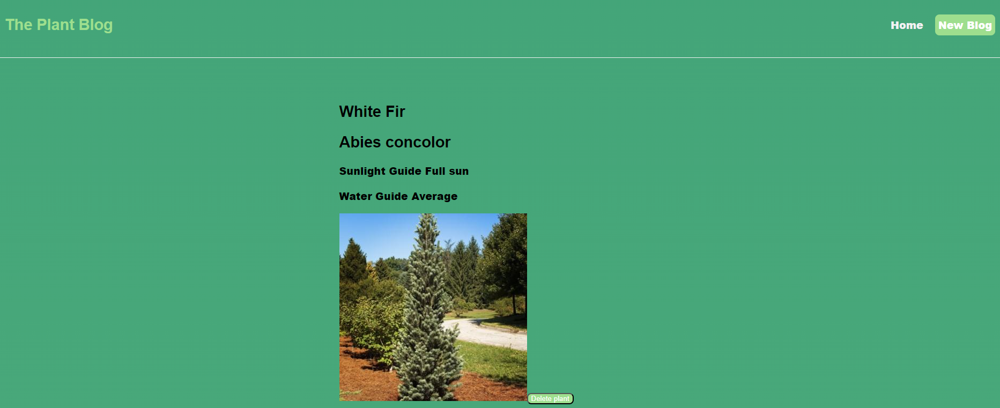

# React + Vite

This template provides a minimal setup to get React working in Vite with HMR and some ESLint rules.

Currently, two official plugins are available:

- [@vitejs/plugin-react](https://github.com/vitejs/vite-plugin-react/blob/main/packages/plugin-react/README.md) uses [Babel](https://babeljs.io/) for Fast Refresh
- [@vitejs/plugin-react-swc](https://github.com/vitejs/vite-plugin-react-swc) uses [SWC](https://swc.rs/) for Fast Refresh
# SBA320

## Table of Contents

- [About](#about)
- [Technologies](#technologies)
- [Future app possibilities](#future-app-possibilities)
- [Screenshots](#screenshots)
- [Site link](#site-link)

## About

Tha website is the task from Software Engineering Bootcamp.
 
The requirements were to create practical web application.
 The app has single page, where as, the user can look for different kinds of plants.
 

The main tasks:

1. Built with HTML, CSS, JavaScript, REACT, and Redux Toolkit.
2. Hosted on Heroku or Netlify.
3. Frequent commits to GitHub.
4. A README.md file in your GitHub repository with:
5. Use AJAX to make a request to an external data source like OMDBapi, and insert some of the data retrieved into the DOM.

## Technologies

- HTML
- CSS
- JavaScript
- REACT
- And UseReducer Hook

## Future app possibilities

There are possibilities to expand app for more features like:

1. Making it more interactive for the users. adding a comment box or a place where you can buy the plants you see.
2. Have one or more complex user interface modules such as a carousel, drag and drop, a sticky nav, tooltips, etc.
3. Change single-page webiste to be more complex, many different routes.
4. I would like to have the pictures of each plant over and display the info about each plant on the back of a "card".
5. Look into localstorage so you can save data to the user's browser.

## Screenshots

1. Home page:
    
   

## Site link

https://remarkable-squirrel-436d78.netlify.app/
